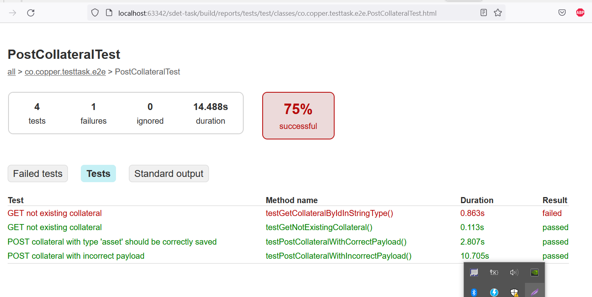

# End to end API testing
Installation requirements:
- JDK starting 11 
- Gradle starting 5

## Test scenarios

## Instructions
To run tests from a terminal use `./gradlew cleanTest test`

### Docker

To crate docker image run  `docker build -t sdet-task-1 .`

To run tests in container against the app run in container use docker compose `docker-compose up --build --abort-on-container-exit`

## Suggestions for the service improvement

1. Add open API generation plugin (done. could be accessed `http://localhost:8080/swagger-ui/index.html`)
2. Add authentication mechanism 
3. Add unit and integration tests
4. Fix bugs
